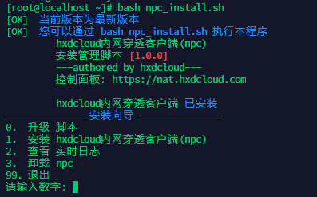

# 通过一键脚本安装

**请以root身份登录命令行！**

### 安装基础应用

安装基础组件`wget`、`curl`、`ca-certificates` *已安装可跳过*

在Ubuntu / Debian上安装

```shell script
apt-get -y install curl wget ca-certificates
```

在RHEL / CentOS / Fedora上安装

```shell script
yum -y install curl wget ca-certificates
```

### 下载并运行一键脚本

```shell script
wget -N --no-check-certificate https://api.minio.hxdcloud.com/npc/npc_install.sh && chmod +x npc_install.sh && bash npc_install.sh
```



+ 按照菜单提示，安装hxdcloud内网穿透客户端
+ 服务器地址和端口可以直接回车，后续会自动获取。若需要指定连接的服务器请参考[手动指定服务器](../specify)
+ 输入连接密钥(vkey)完成安装

**若出现无法安装、无法连接等问题，请在脚本中选择查看实时日志，将日志内容发送给管理员**