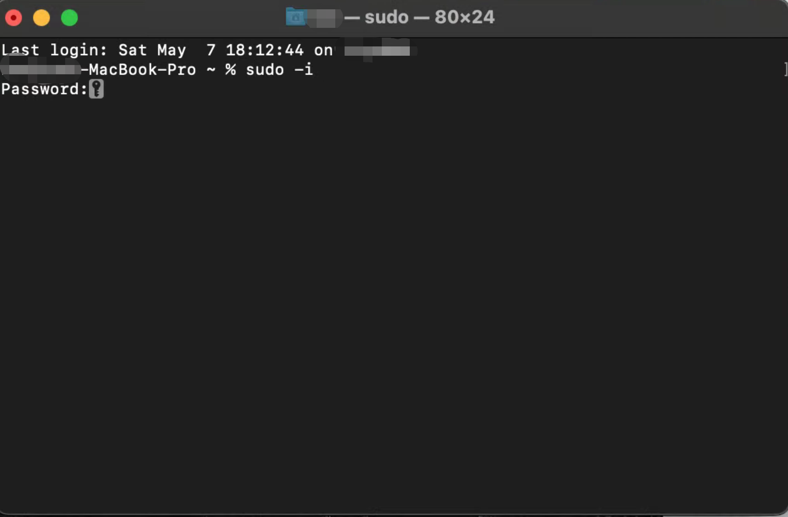
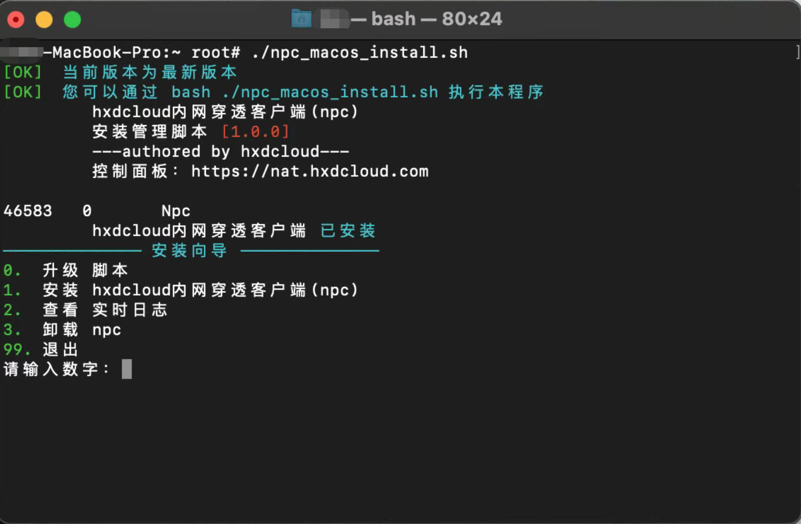

# 通过一键脚本安装

以下内容仅在intel处理器(x86_64)的MacOS下测试通过，若您是m1/m2芯片处理器也可以按照如下教程操作，若能成功安装欢迎您反馈给我们

### 打开终端

按下Command-空格键输入terminal，选择终端
或者在程序坞中搜索“终端”
> macOS下打开终端的方式请参考Apple官网[《终端使用手册》](https://support.apple.com/zh-cn/guide/terminal/apd5265185d-f365-44cb-8b09-71a064a42125/mac)

### 安装基础组件*已安装可跳过*

**如果您的macOS上还没有安装Homebrew，请先安装Homebrew**

> Homebrew是一款Mac OS平台下的软件包管理工具，拥有安装、卸载、更新、查看、搜索等很多实用的功能。简单的一条指令，就可以实现包管理。
> 一键安装命令(大概会持续几分钟)
> ```shell script
>   /bin/zsh -c "$(curl -fsSL https://gitee.com/cunkai/HomebrewCN/raw/master/Homebrew.sh)"
> ```

确保您已经安装了brew后，运行以下命令。注意：**使用brew安装程序不可以在root用户下执行**

```shell script
brew install curl wget ca-certificates
```

### 切换到root用户

在终端内输入sudo -i，然后输入当前登录用户的密码


### 下载并运行一键脚本

```shell script
wget -N --no-check-certificate https://api.minio.hxdcloud.com/npc/npc_macos_install.sh && chmod +x npc_macos_install.sh && bash npc_macos_install.sh
```



+ 按照菜单提示，安装hxdcloud内网穿透客户端
+ 服务器地址和端口可以直接回车，后续会自动获取，若需要指定连接的服务器请参考[手动指定服务器](../specify)
+ 输入连接密钥完成安装

**若出现无法安装、无法连接等问题，请在脚本中选择查看实时日志，将日志内容发送给管理员**