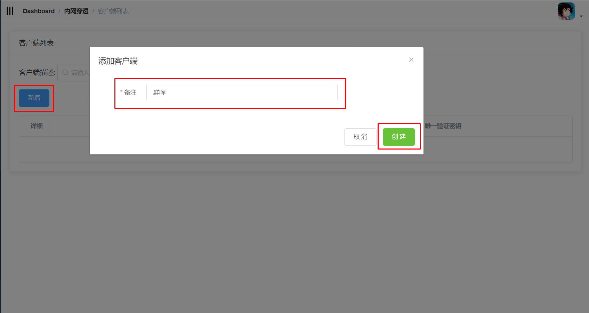

# 准备工作

### 新增客户端

开始安装客户端之前，请登录系统，进入菜单**内网穿透-客户端列表**中新增一个客户端。

新增完成后会得到一个**唯一验证密钥(vkey)**，后续安装时需要用到。

在同一个局域网内，**只需要安装一个客户端**，局域网中所有服务都可以实现内网穿透。

> 客户端指的是安装在您内网的设备（如Windows电脑，Linux虚拟机，MacOS，NAS等设备）上的软件，用于与我们提供的服务端进行连接，实现内网穿透

点击新增按钮，输入备注（用于标识安装在你的什么设备上，如：群晖），新增一个客户端。
  