# 通过docker套件安装

### 打开套件中心，搜索docker并进入

**若未安装docker套件请先安装后再进入**

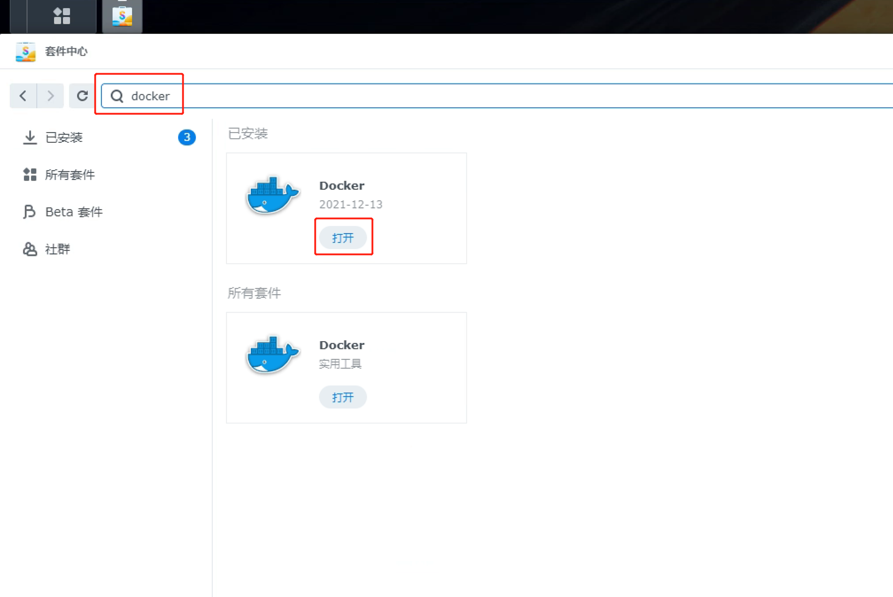

### 搜索内网穿透客户端镜像

在弹出框的左侧菜单中点击注册表，右侧搜索栏中输入：**hxdcloud/npc，请勿选错成nps，那个是服务端**，请注意一定要使用我们的镜像，否则无法实现自动连接多个服务器。

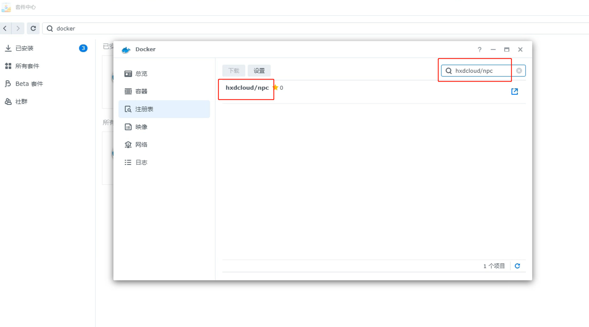

### 下载内网穿透客户端镜像
 
选中hxdcloud/npc（如果可以请您顺手点一个⭐）点击下载按钮，选择latest标签，完成下载
 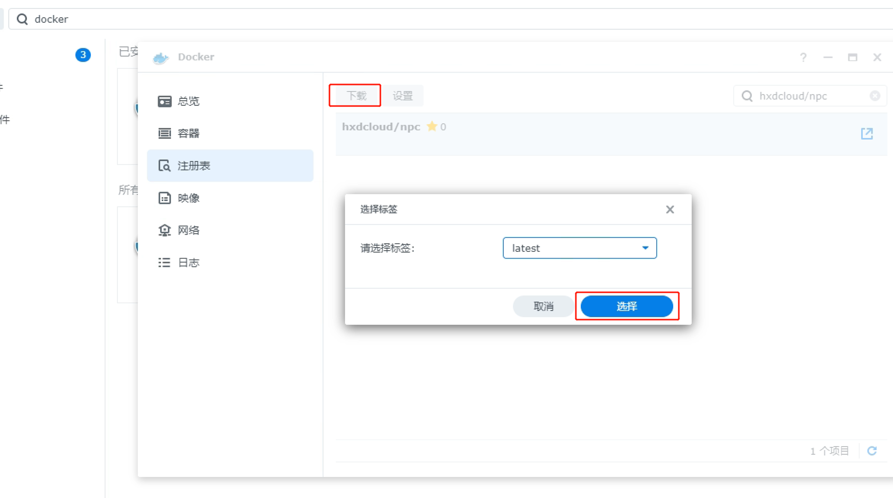

### 创建容器

在Docker弹出框中，点击左侧映像菜单，找到刚才下载的hxdcloud/npc镜像

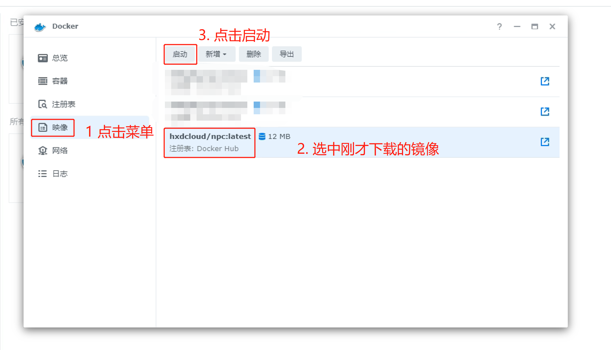

点击启动后，请按照如下截图所示完成所有配置

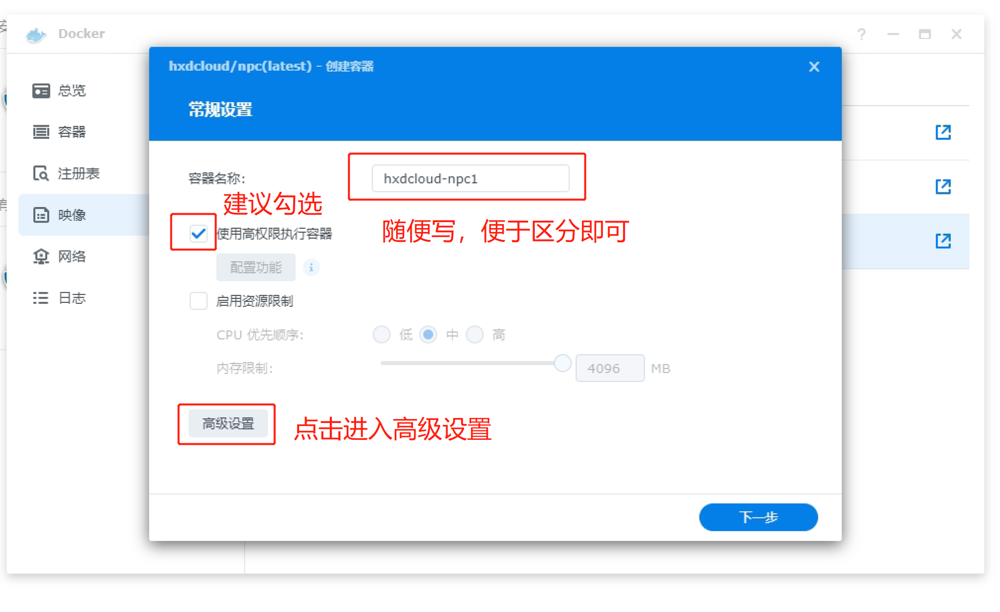
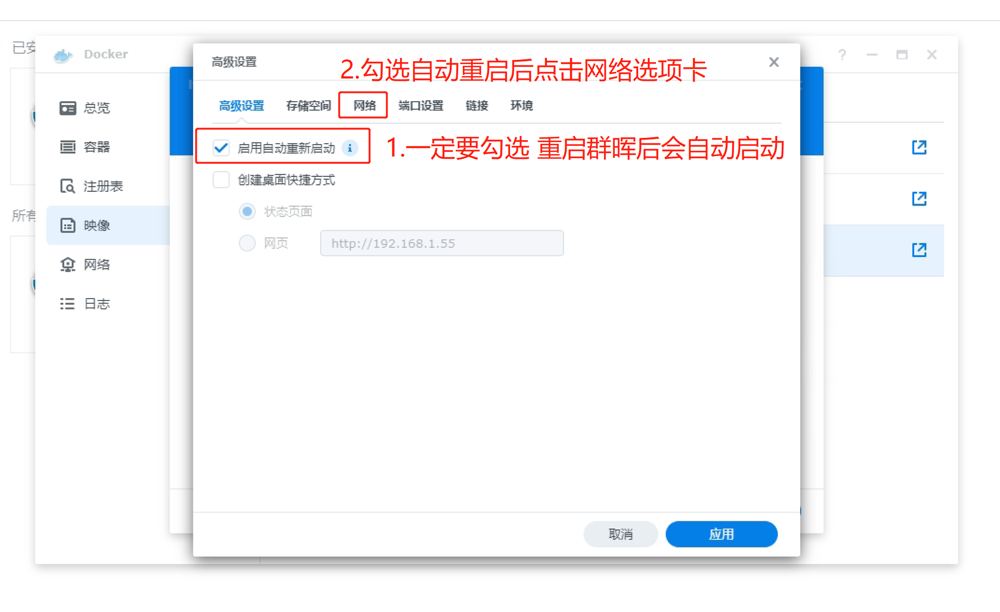
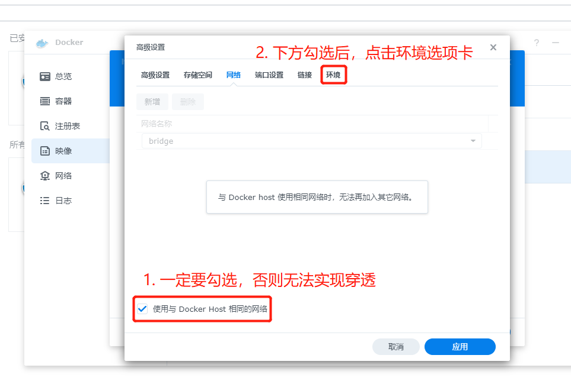
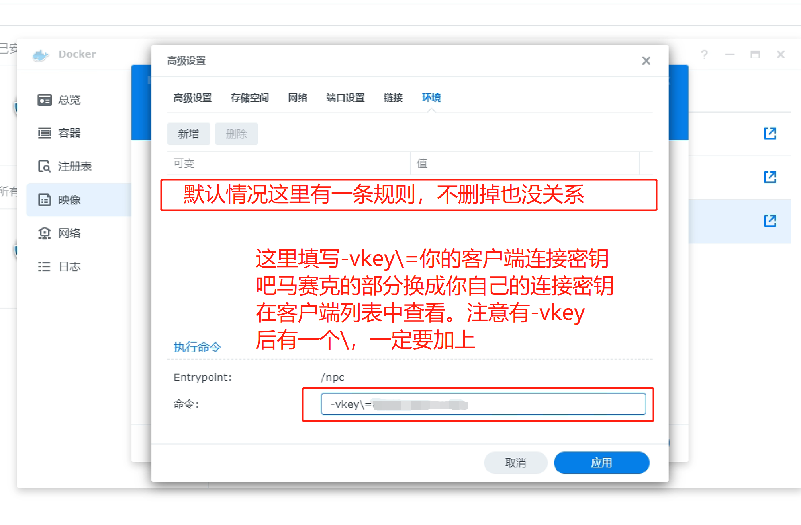

至此客户端已经配置完成，要检查是否正常运行，请按照如下方式查看日志。**当客户端无法正常连接时，请查看日志截图给管理员**

### 查看日志

在Docker弹出框中，点击左侧容器菜单，根据容器名称找到刚才安装的客户端

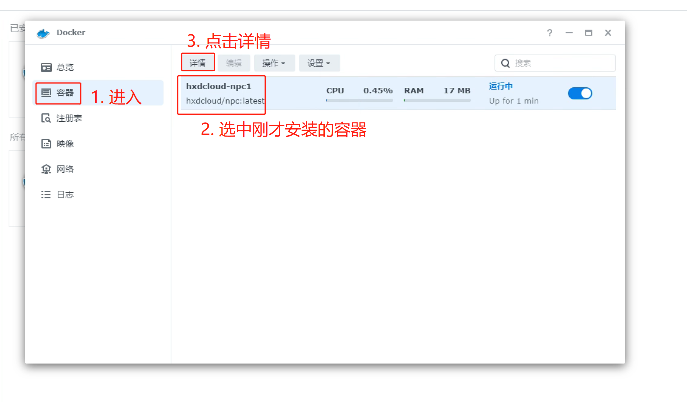
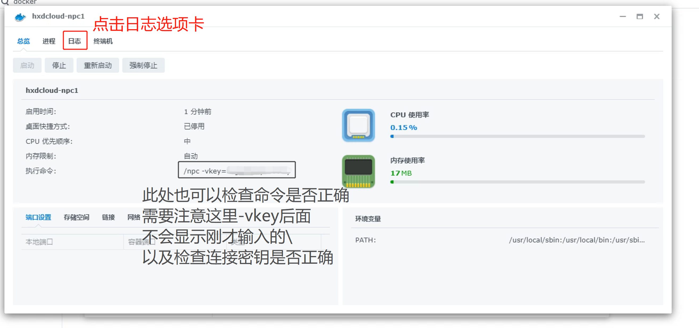
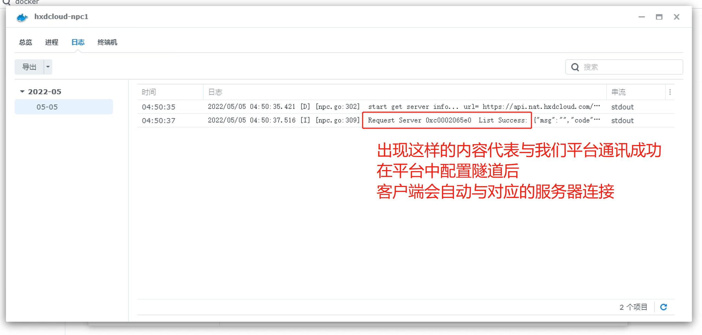