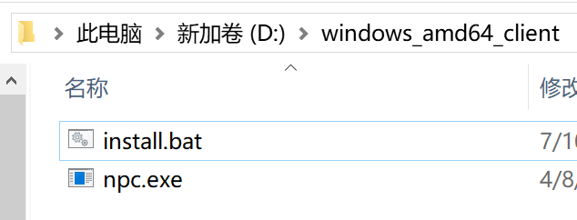
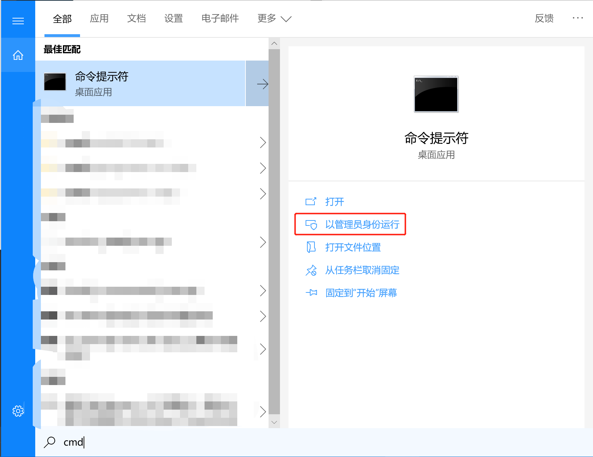
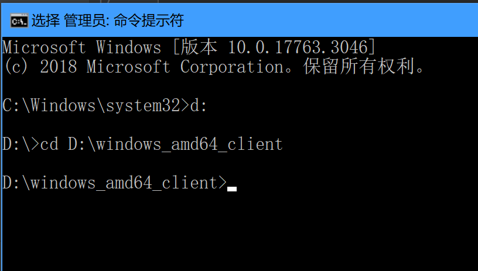
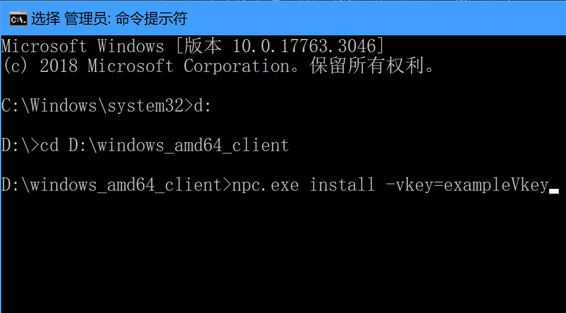

# 通过命令行手动安装

### 以管理员身份运行cmd.exe

以下教程以我将客户端解压至目录_D:\windows_amd64_client_为例



按下Win键+S或点击左下角搜索按钮，输入cmd



点击**以管理员身份运行**

### 在命令行中进入客户端解压后的目录所在盘符

例如我的安装目录在D盘下，输入命令

```shell
d:
```

其他盘符同理，C盘可以略过此步。

在命令行中进入客户端解压后的目录，输入命令

```shell
cd D:\windows_amd64_client
```



### 执行安装命令

在命令行中输入
```shell
npc.exe install -vkey=替换成你的vkey
```



**安装完成后是没有返回信息的**

### 启动客户端

在命令行中输入
```shell
npc.exe start
```