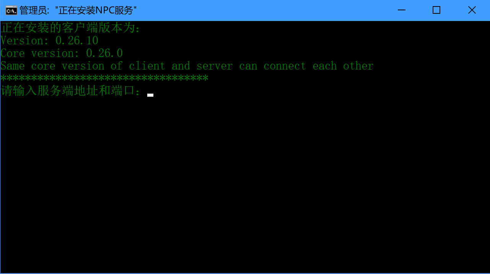
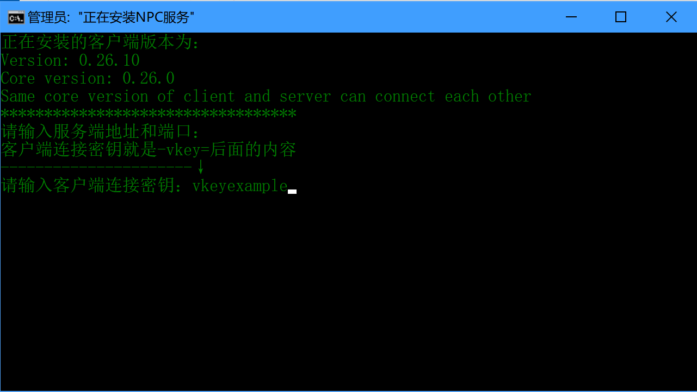
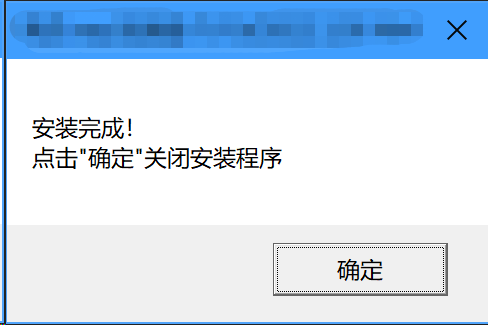

# 通过一键脚本安装

**如果您安装的windows为服务器版、精简版等，可能无法正常通过脚本安装，请参考[通过命令行安装](manual)**

+ 下载客户端解压后，双击运行install.bat文件

+ **输入服务器地址和端口可以直接回车**，客户端会自动获取。若需要指定连接的服务器请参考[手动指定服务器](../specify)

+ 输入管理后台中**客户端列表**中对应的**唯一验证密钥(vkey)**，回车

+ 出现安装完成弹出框代表安装成功

